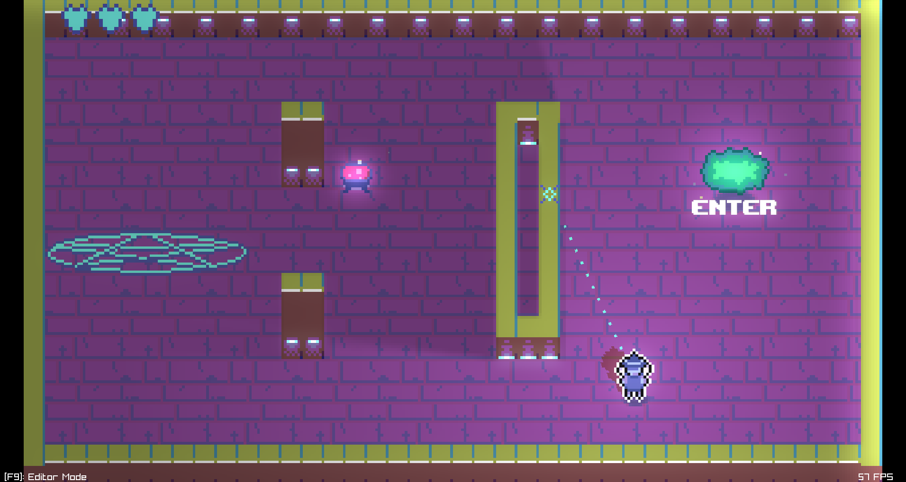
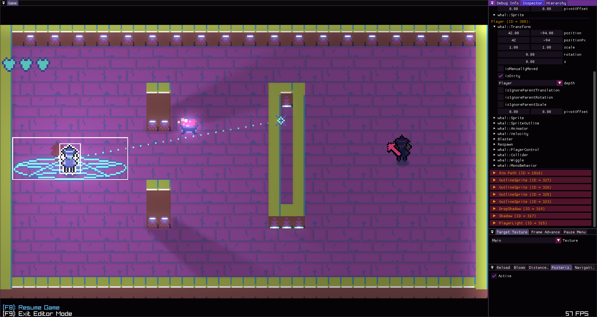

This is a 2D game engine written in C++ to learn game development. This project contains:
- Custom fork of Raylib for graphics (formerly used OpenGL).
- A bespoke pixel-perfect Physics engine.
- FMOD audio integration.
- Custom Entity Component System (ECS).
- Custom Tweening library.
- Tilemap support (Tiled).
- Tweening.
- Job Scheduling.
- Hot Reloading. 
- Ray-traced shadows.
- Support for Linux, Windows, and Web builds.
- Automatic struct serialization using compile-time reflection on C++ 20.
- Dear ImGUI debug menu with realtime entity inspection.
- And more!





# Usage

Creating a game requires implementing the `IGame` interface and defining the following functions with the C ABI:

```cpp
// In this case Game implements IGame
extern "C" whal::IGame* CreateGame() {
    return new Game();
}

extern "C" void DestroyGame(whal::IGame* game) {
    delete game;
}
```

Building a Game implementation as a DLL allows for hot-reloading changes without closing the program.

# Installation Requirements (Windows and Linux)

- CMake 
- Clang (any version that supports C++20)
- Ninja

## Building custom raylib fork 

In addition to the above requirements, the current configuration requires building a custom fork of Raylib:

- `cd` into `whalengine/lib/raylib/src`
- run `make PLATFORM=<platform> RAYLIB_BUILD_MODE=<DEBUG or RELEASE> RAYLIB_LIBTYPE=<SHARED or STATIC>`
    - must be SHARED for hot reloading setup
    - put generated library files into `whalengine/core/bin/<platform>`

# Building for Linux


```
git clone https://github.com/whaleymar/whalengine-rl.git
cd whalengine-rl 
git submodule update --init --recursive
make
```

# Building for Windows

Requires Microsoft Visual C++ (MSVC) compiler. This project wasn't built for Visual Studio and I have no idea how that IDE works, so instead you have to open `x64 Native Tools Command Prompt` (find using Windows search) to compile. Confirm you have a working MSVC compiler by typing `cl`, which should list information about the compiler. Next, confirm you have clang by running `clang-cl -v` (should see similar output). 

*From here you have a couple options:*

## VSCode 
From the `x64 Native Tools Command Prompt` type `code .` and hit enter. This should open VSCode. Now, open the project. Make sure you have the following extensions:
1. C/C++ IntelliSense, debugging, and code browing (Microsoft)
2. CMake (twxs)
3. CMake Language Support (Jose Torres)
4. CMake Tools (Microsoft)

(I have no idea if some of the CMake extensions are redundant).

Hit `ctrl+shift+p` to open the command listing, search CMake, and click `CMake: Build`

## CMake (from command line)
`cd` to the project directory and run `make`

# Building for Web

Requirements:
- emscripten (and emcmake). Follow these instructions: https://emscripten.org/docs/getting_started/downloads.html
- Compile raylib for web:
    - `cd` to raylib's `src` directory
    - run `make PLATFORM=PLATFORM_WEB -B`
    - copy `raylib/src/build/raylib/libraylib.a` to `lib/`
    - back in your game's root directory, run `make webdebug` or `make webrelease`
